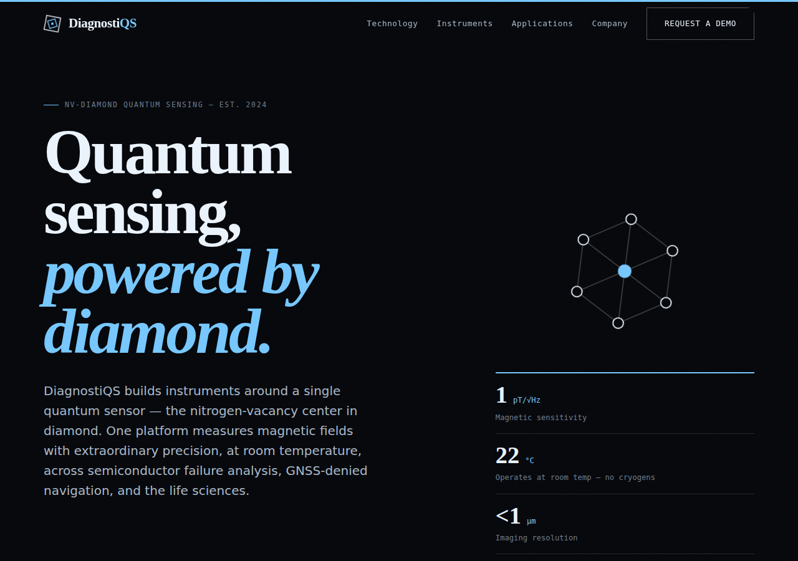

# Deeptech Web Templates

A growing collection of polished, production-minded website templates for
deeptech companies — the kind of hard-science startups that need a credible,
modern web presence without a heavyweight build pipeline.

Each template is **self-contained static HTML/CSS/JS**: no framework, no build
step, no dependencies to install. Open the file in a browser and it works.
Drop it on any static host (GitHub Pages, Netlify, Cloudflare Pages, S3) as-is.

## Templates

| Template | Industry | Path |
| --- | --- | --- |
| **DiagnostiQS** | Quantum sensing (NV-diamond diagnostics) | [`quantum-sensing/`](./quantum-sensing) |

> More verticals (photonics, fusion, biotech, space, advanced materials) will
> follow the same structure.

## Quantum Sensing — `quantum-sensing/`

A landing page for a fictional NV-diamond quantum-diagnostics company,
*DiagnostiQS*. Demonstrates the conventions every template in this repo follows.



### Features

- **Edit everything in one file** — all words, numbers, links, and lists live
  in [`content.js`](./quantum-sensing/content.js). Change it, refresh, done.
  No HTML editing, no build step (see *Editing the content* below).
- A distinctive **dark editorial** aesthetic: near-black background, light
  text, a bold diamond-blue accent, fine grain texture, editorial serif
  headlines, oversized section index numerals, and a broken (asymmetric) grid
- Asymmetric editorial hero with an animated line-art diamond-lattice figure
  (NV centre highlighted) and a spec-sheet stat list
- A scrolling partner **marquee**, reveal-on-scroll via `IntersectionObserver`
- Sections: hero, trust marquee, technology, how-it-works, instruments with
  spec tables, applications, company, and a contact form
- Accessible: skip link, semantic landmarks, keyboard-friendly nav,
  reduced-motion support (marquee + animations disable under `prefers-reduced-motion`)
- Type system: **Fraunces** (editorial serif display) + **IBM Plex Sans**
  (body) + **IBM Plex Mono** (labels), loaded from Google Fonts

### Run it locally

No build step. Either open the file directly:

```bash
open quantum-sensing/index.html        # macOS
xdg-open quantum-sensing/index.html    # Linux
```

…or serve it (recommended, so relative paths behave like production):

```bash
cd quantum-sensing
python3 -m http.server 8000
# then visit http://localhost:8000
```

### File layout

```
quantum-sensing/
├── index.html        # structural shell — mount points only, rarely edited
├── content.js        # ← ALL editable content lives here (text, specs, links)
├── css/styles.css    # design tokens + components (edit :root to re-theme)
├── js/main.js        # renders content.js into the page + interactions
└── assets/
    └── favicon.svg
```

### Editing the content

`content.js` is a single, heavily-commented `window.SITE = { … }` object.
`js/main.js` reads it and renders the page, so:

- **Change text / numbers** — edit the value between the quotes.
- **Add a product, card, stat, or nav link** — copy one `{ … }` block in the
  relevant list and tweak it (keep the trailing comma).
- **Remove one** — delete its `{ … }` block.

You never touch HTML or CSS to change copy. Example — adding a fourth hero stat:

```js
stats: [
  { value: "1",  unit: "pT/√Hz", label: "Magnetic sensitivity" },
  { value: "22", unit: "°C",     label: "Operates at room temp" },  // ← new
],
```

> **Want a visual, in-browser editor instead?** Because the markup is static,
> this template drops straight into a git-based CMS like
> [Decap CMS](https://decapcms.org/) or [TinaCMS](https://tina.io/) so
> non-developers can edit via a UI with live preview. That's an optional
> upgrade — ask and it can be wired in.

### Re-theming

- **Colors, fonts, geometry** — edit the CSS custom properties in `:root` at
  the top of `css/styles.css` (`--accent`, `--signal`, `--bg`, `--font-*`,
  `--notch`, `--radius`). Everything cascades from there.
- **Wire the contact form** to a real backend — the current handler in
  `js/main.js` is a client-side demo that validates and shows a confirmation.

> **Note on SEO:** content renders client-side from `content.js`, which keeps
> editing trivial but means search crawlers need JS execution (modern crawlers
> handle this). For maximum SEO you can pre-render to static HTML or adopt the
> CMS path above — happy to set either up.

> ⚠️ All company details, specifications, and figures are **illustrative**,
> created for this demonstration template.
